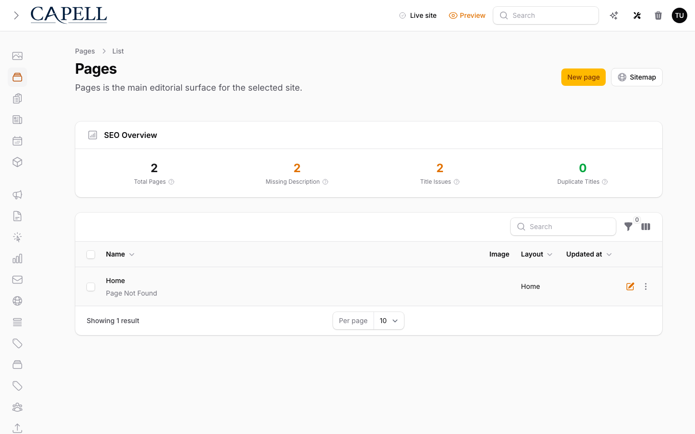

# Subscriber Manager



> **Who is this for?**
> Package developers and advanced applications that need fine-grained, repeatable event subscriptions in Capell Core—particularly for validation gates and stateful listeners.

> **TL;DR:**
> Use `SubscriberManager` to register class-based subscribers that listen to core events. Call `notifySubscribers()` to invoke all listeners, or `validateWithSubscribers()` to short-circuit on validation failures.

---

## When to use this

`SubscriberManager` is a lower-level subscription API intended for **core domain events**—those that fire during domain operations (page saves, site replication, package installation).

- **Use `SubscriberManager`** when you need:
    - **Validation gates**: Subscribers that return `false` to block an operation.
    - **Repeatable subscriptions**: Multiple independent subscribers listening to the same event.
    - **Class-based subscribers**: Structured, testable listener classes (not one-off closures).
    - **State tracking**: Subscribers that need to accumulate results or side effects.

- **Use the simpler `CapellAdmin` event registry** (see [`extending-capell.md` §5](./extending-capell.md#5-event-registry-callbacks--subscribers)) when you need:
    - Lightweight admin-panel lifecycle hooks (`afterSave`, `beforeDelete`, etc.).
    - One-off callback functions.
    - No validation logic.

---

## How it's wired

### Registration & Discovery

`SubscriberManager` is bound in the container by `CapellServiceProvider`:

```php
$this->singleton(SubscriberManager::class);
```

There is no automatic discovery; subscribers are registered explicitly via package service providers or `CapellCore::subscriberManager()->subscribe(SubscriberClass::class)`.

### Dispatch

Events are instantiated as simple data objects (e.g., `PageSaved`, `SiteCreated`) and passed to:

```php
$manager->notifySubscribers('page.saved', $eventInstance);
// or
$manager->validateWithSubscribers('page.saving', $eventInstance);
```

This happens inside Actions and domain code, not Laravel's event dispatcher. **`SubscriberManager` is orthogonal to Laravel's events.**

### File Paths

- Manager: `packages/core/src/Support/Subscriber/SubscriberManager.php`
- Contracts: `packages/core/src/Support/Subscriber/Contracts/{Subscriber,ValidatingSubscriber}.php`
- Events: `packages/core/src/Events/*.php`

---

## Public API

```php
public function subscribe(string $subscriber): void
```

Register a subscriber class. Must implement `Subscriber` or `ValidatingSubscriber`.

```php
public function unsubscribe(string $subscriber): void
```

Deregister a subscriber class.

```php
public function getSubscribers(): array
```

Return array of registered subscriber class names.

```php
public function hasSubscriber(string $subscriber): bool
```

Check if a subscriber is registered.

```php
public function notifySubscribers(string|BackedEnum $event, object $context): void
```

Invoke all subscribers with the event name and context object. Resolves each subscriber from the container and calls `handle()`.

```php
public function validateWithSubscribers(string|BackedEnum $event, object $context): bool
```

Invoke validation subscribers. Returns `false` if any `ValidatingSubscriber` returns `false`; short-circuits and returns `true` otherwise. Plain `Subscriber` instances are skipped.

---

## Available Events

| Event Class          | Context Type  | When Fired                                                    |
| -------------------- | ------------- | ------------------------------------------------------------- |
| `PageSaved`          | `Pageable`    | After a page is created or updated                            |
| `PageDeleted`        | `Pageable`    | After a page is deleted                                       |
| `SiteCreated`        | `Site`        | After a site is created                                       |
| `SiteReplicated`     | `Site` (both) | After a site and all its pages are cloned (includes mappings) |
| `PackageInstalled`   | `PackageData` | After a package is installed                                  |
| `PackageUninstalled` | `PackageData` | After a package is uninstalled                                |
| `ThemeColorsUpdated` | `Theme`       | After theme color settings are updated                        |
| `ServingCapell`      | (empty)       | When the frontend boots (used to signal Capell is running)    |

Event names are passed as strings (e.g., `'page.saved'`) or as backed enum values.

---

## Example: Class-Based Subscriber

### Step 1: Implement the Subscriber interface

```php
<?php

declare(strict_types=1);

namespace App\Subscribers;

use Capell\Core\Events\PageSaved;
use Capell\Core\Support\Subscriber\Contracts\Subscriber;

final class LogPageSaveSubscriber implements Subscriber
{
    public function handle(string $event, object $context): void
    {
        if (! $context instanceof PageSaved) {
            return;
        }

        logger()->info('Page saved', [
            'page_id' => $context->page->id,
            'slug' => $context->page->slug,
        ]);
    }
}
```

### Step 2: Register in a service provider

```php
<?php

declare(strict_types=1);

namespace App\Providers;

use App\Subscribers\LogPageSaveSubscriber;
use Capell\Core\Support\Subscriber\SubscriberManager;
use Illuminate\Support\ServiceProvider;

final class AppServiceProvider extends ServiceProvider
{
    public function boot(): void
    {
        $manager = resolve(SubscriberManager::class);
        $manager->subscribe(LogPageSaveSubscriber::class);
    }
}
```

### Step 3: Use a validating subscriber to block operations

```php
<?php

declare(strict_types=1);

namespace App\Subscribers;

use Capell\Core\Events\PageSaved;
use Capell\Core\Support\Subscriber\Contracts\ValidatingSubscriber;

final class EnforcePageSlugPrefixSubscriber implements ValidatingSubscriber
{
    public function handle(string $event, object $context): void
    {
        // Called after validation passes; perform side effects here.
    }

    public function validate(string $event, object $context): bool
    {
        if ($event !== 'page.saving' || ! $context instanceof PageSaved) {
            return true;
        }

        // Block the save if slug doesn't match our convention.
        return str_starts_with($context->page->slug, 'policy-');
    }
}
```

When `validateWithSubscribers('page.saving', $pageSaved)` is called, if this subscriber returns `false`, the action halts without proceeding.

---

## Gotchas

1. **Event name != class name.** Event instances are classes (e.g., `PageSaved`), but event names are strings (e.g., `'page.saved'`). Your subscriber must check both the string and optionally type-guard the object.

2. **No automatic injection.** Subscribers are resolved from the container but do not receive constructor dependencies automatically in `handle()`. Inject them in `__construct()` and store as properties, or resolve them manually inside `handle()`.

3. **Validation subscribers only.** `ValidatingSubscriber` is the only interface that short-circuits. Plain `Subscriber` instances are called by `validateWithSubscribers()` but their return value is ignored.

4. **Order is insertion order.** Subscribers execute in the order they were registered. If you need a specific order, register them in that order.

5. **Enum values.** Event names can be `BackedEnum` constants (e.g., `PageEvent::Saved->value`). The manager extracts the string value automatically.

---

## Related

- [Extending Capell: Event Registry (§5)](./extending-capell.md#5-event-registry-callbacks--subscribers) — simpler callback-style API for admin lifecycle events.
- [Admin event registry](../../admin/docs/event-registry.md) — admin-layer event subscriptions (higher-level).
- [Content management](./content-management.md) — domain context where `SubscriberManager` is typically dispatched from.
